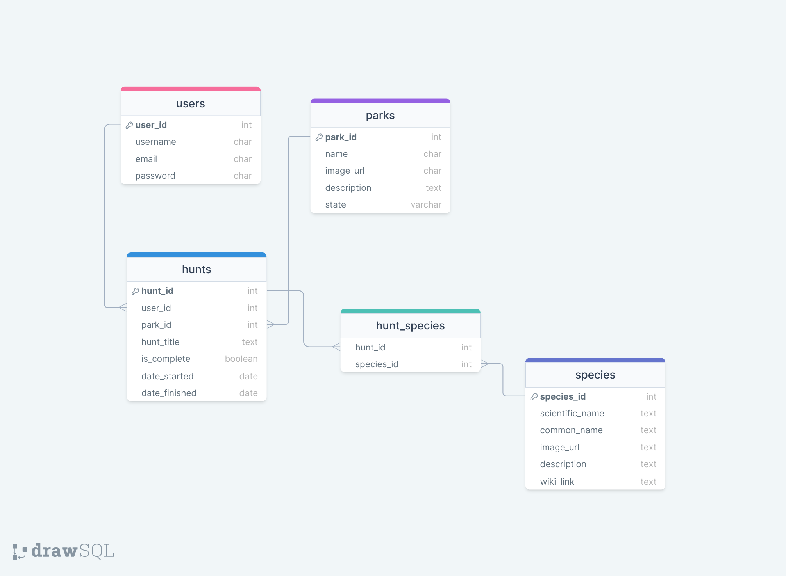

# Project Proposal: National Parks Scavenger Hunt

## 1. Tech Stack

For this project, I will use the following tech stack:

- **Frontend:** React
- **Backend:** Express
- **Database:** PostgreSQL

## 2. Focus of the Project

This will be a full-stack application with emphasis on making the front end responsive, well-designed and easy for users to navigate.

## 3. Platform

The application will be a responsive web application, accessible on both desktop and mobile devices.

## 4. Project Goal

The goal of the National Park Scavenger Hunt is to provide users with a platform to create and participate in scavenger hunts for various national parks that they are visiting. Users can register, log in, create personalized hunts, and keep track of completed and ongoing hunts.

## 5. User Demographic

The primary users of the app are nature enthusiasts, families, and individuals who enjoy exploring national parks and participating in scavenger hunts. The app is designed to be user-friendly for people of ages 10 and up.

## 6. Data Usage

Data for the app will be sourced from a custom database that includes tables for users, parks, animal species, hunts, and hunt items. Data will also come from the [National Park Service species list database](https://irma.nps.gov/NPSpecies) and the [National Park Service API](https://www.nps.gov/subjects/developer/api-documentation.htm). I will also integrate images and information about animal species using the Google Knowledge Graph API. The database will be implemented using PostgreSQL. 

## 7. Approach Outline

### a. Database Schema

The database schema will include tables for Users, Parks, Species, Hunts, and Hunt Species. Relationships will be established using foreign keys.

### b. Security

This app will not contain any sensitive user information but passwords will be securely hashed. Additionally, authentication and authorization will be implemented to ensure users only have access to their own scavenger hunts.

### c. App Functionality

- User registration and authentication
- Species information display
- Create, edit, and delete scavenger hunts
- Track completed and in-progress hunts

### e. User Flow

1. User registers or logs in.
2. User home page shows existing in progress and completed hunts. There is also the option to create a new scavenger hunt.
3. User creates a personalized scavenger hunt, first selecting the state that their park is located in, and then the national park itself.
4. User can then select species that are native to that park.
5. User can either accept the hunt as is, or modify or delete suggested species.
6. If user chooses to modify a particular species, they will be given the option of chosing another random species that is found in the park.
7. Scavenger hunt is accepted and saved to database.
8. User participates in hunts, checking off tracking progress.
9.  User views completed hunts and achievements.

### f. Unique Features and Stretch Goals

- **[Feature ]:** Introduce badges/rewards for completing a certain number of scavenger hunts. 

- **[Stretch Goal]:** Unlock achievement badges for locating rare/endangered/keystone animal species.

